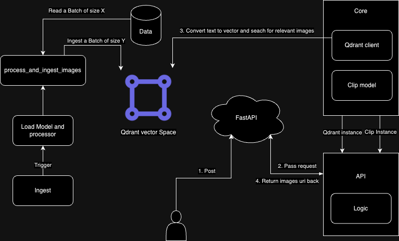

### Text2Search - Qdrant 

### Quick Start 

- (1) In a location where you want to place this repo, use the following commands:

```bash
git clone git@github.com:alialagrami/text2image-search.git
cd text2image-search
source setup.sh
```

- (2) to start backend services

```bash
source start.sh
```

- (3) In another terminal to download and ingest the data

```bash
source download_ingest_data.sh
```

### Usage 
```bash
import requests
url = 'http://0.0.0.0:8000/semantic_search/'
myobj = {'input_text': 'car'}
response = requests.post(url, json = myobj)
```


###  Add Your Own Data
i. Place your images into the data/{your_directory_name} directory.
ii. change config file to point to your directory name
iii. ingest them into qdrant with the following script
```bash
source ingest.sh
```


## Architecture 


- Through the config.yml we can define
	- Qdrant configs
		- host 
		- port
	- Data Ingestion
		- image_dir : name of directory within data folder
		- batch_size: size of the batch to ingest images
		- data_limit: number of the images to be ingested
	- Model config 
		- model_id: id of the model to be loaded ("now only clip")
		- vector_size: size of the vector to be used and ingested to Qdrant

When triggering "python ingest"
- connect to Qdrant by the Qdrant client and create a collection
- the model and processor is loaded
- images are read in batches and ingested into the Qdrant batch at a time
- images processed vectors are also saved in pkl file for later use if needed

When triggering "python app"
- connect to Qdrant by the Qdrant client as a global instance
- load model and processor as a global instance
- when receiving a post request it is passed to the api logic which 
	- convert text to vector using clip instance
	- use qdrant instance to search for similar vectors (images) then return these

## Challenges and potential improvements
- Optimizing ingestion  --> ( resize images, parallel processing )
- Make system model free ( for now it is only clip but it can be extend to allow other models )
- Als can be improved 
	- API logic to do some validations on the retrieved images
	- Allow more customizations for the api 
	- Use more advanced models like llama2 
